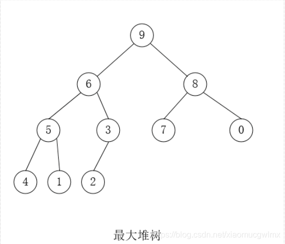
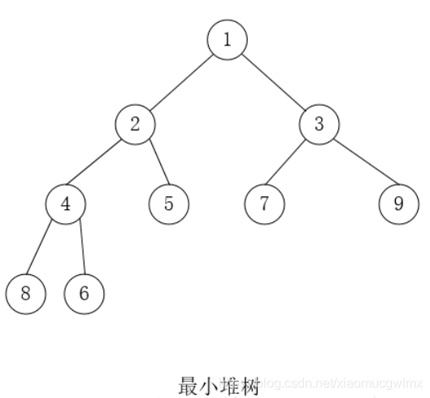
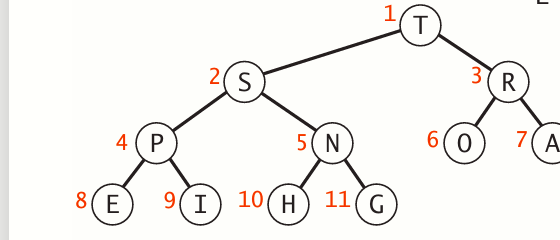
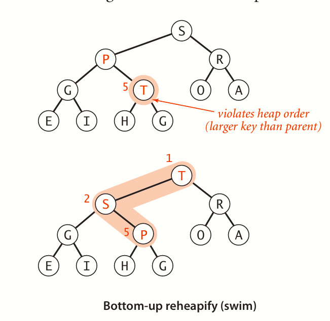
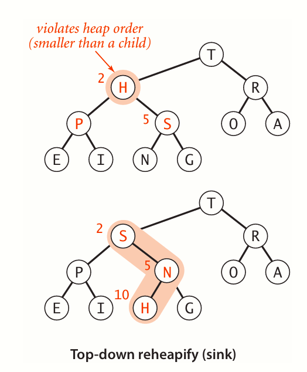

An appropriate data type in such an environment supports two operations: remove the maximum and insert. Such a data type is called a priority queue.

# API

| API name | API description |return|
|----------|-----------------|------|
|create_priorityqueue()|create a priorityqueue|*struct PriorityQueue|
|create_priorityqueue_with_capacity(int capacity)|create a priorityqueue with an initial capacity|*struct PriorityQueue|
|create_priorityqueue_with_list(Item[] items)| create a priorityqueue with an initial item list|*struct PriorityQueue|
|insert(Item item)|insert a item into the priorityqueue|void|
|remove_max()|remove the max item|Item|
|remove_min()|remove the min item|Item|
|max()|get the max item (with remove_max())|Item|
|min()|get the min item (with remove_min())|Item|
|is_empty()|is the priorityqueue empty|bool|
|size()|get the total size of priorityqueue|int|

我们可以想象队列中的内容是含有权重的，每次我们都需要执行其中权重最大的内容我们可用简单的数字大小来表示任务的权重大小。

# 数组实现

<h3>无序数组</h3>
最简单的一种实现方法就是数组，显然我们可以将新的任务插入到数组的末尾，再在找到最大任务的时候去除，这样的无序数组我们插入可以做到O(1)的复杂度，但是每次弹出最大元素的时候都需要O(N)的复杂度。同时要考虑的就是移动元素也需要一定的复杂度，也是线性的，所以最后就是O(N)的复杂度。
<h3>有序数组</h3>
如果我们在插入的时候考虑这个队列就是有序的，在求解最值中我们只需要考虑弹出固定位置的元素，比如把最值放在第一个或最后一个位置就行。这样弹出最值的时间复杂度为O(1),但是我们在每次插入的时候都需要遍历一次数组，这样我们插入时就必须要使用O(N)的时间复杂度

<h4>优点:缓存命中率高，当查找需求高于删除需求时非常有用</h4>
<h4>缺点:当删除需求高于查找需求时，时间复杂度极高，空间利用率不高</h4>

# 链表实现

<h3>无序链表</h3>
与无序数组对应，插入到末尾只需要O(1)的时间复杂度，但是在弹出最值时需要O(N)的时间复杂度
<h3>有序链表</h3>
与有序数组对应，我们考虑在插入的时候就将权重进行排序，此时所需要的时间复杂度达到O(N)，但是弹出最值都是O(1)的时间复杂度

<h4>优点：当删除需求高于查找需求时较数组方式效率更高</h4>
<h4>缺点：链表由于是复合数据结构，所需要的空间操作较数组更多</h4>

<h3 style="color:red;">我们可以观察到一个事实：两种基础的实现方法的复杂度及其“不平衡”，这里的不平衡是指其中一种操作为O(1)，而另外一种操作为O(N),那么，能不能找到一种正确的数据组织方式，来均摊这两种操作的时间复杂度呢？</h3>

# 二叉堆实现(binary heap)

首先，我们考虑一个问题，在我们使用基础的结构来实现的时候，我们的操作是相对独立的，插入这件事就是直接插入，而排序的时候我们只做排序，我们能不能在插入的时候同时进行排序？这样就相当于分担成两种操作，我们在之前学过二分这一思想，二分往往能做到O(logN)的复杂度，这时候我们就能想到一种利用二分的数据结构——<strong>二叉树</strong>

我们可以考虑把队列中的任务根据权重排到一颗二叉树里，这里的二叉树要满足的一点就是：<strong style="color:red;">对于一个父节点和其子节点来说，父节点要大于子节点（大根） 或 父节点要小于子节点（小根）</strong>，从左至右，从上到下，我们一定能做出一颗完全二叉树。我们把这样的数据组织方式命名成<strong>二叉堆或堆</strong>

**现在我们能保证根节点一定是最值出现的地方**

**然后我们还发现一点：既然堆是一种完全二叉树，那么，我们根据层数是可以定位到每一层的元素的**

**假设树的节点个数为n，以1为下标开始编号，直到n结束。对于节点i，其父节点为i/2；左孩子节点为i*2，右孩子节点为i*2+1。最后一个节点的下标为n，其父节点的下标为n/2。**

<h4 style="color:aqua">所以我们可以用一个数组来表示堆</h4>

**现在我们要解决就是两个问题：**
**(1)当有新的值进入的时候，怎么保证新值能到它需要在的地方？(插入问题)**
**(2)当根节点被弹出之后，如何找到新的根节点？(删除问题)**

<h2>上浮(swim)</h2>
当新加入一个值的时候，我们将它放到最底部从左至右第一个为空的节点里，然后就像气泡上浮一样，与父节点进行比较，以大根堆为例，如果新插入的子节点比父节点要小，那么就不进行任何操作，如果比父节点要大的情况下，就和父节点交换，然后对于新的父节点继续进行以上操作，直到比父节点要小，或者已经到根节点

<h2>下沉(sink)</h2>
我们以大根堆为例，和上浮相反，相对于对于上浮的子节点，父节点的操作更像是气泡下沉一样，下浮的父节点和子节点继续比较，如果父节点比其子节点更小，则将父节点和子节点进行交换，直到父节点大于其子节点，或父节点成为叶子节点

**上浮和下沉是二叉堆的基本操作，通过上浮和下称，我们就能实现二叉堆的插入操作和弹出最大元素的操作**

## 插入
我们将新元素加到数组最后，也就是当前二叉堆的第一个空节点，然后对新元素执行上浮操作
## 删除
我们将第一个元素弹出，然后把二叉堆的最后一个元素移到第一个元素的位置，然后对移动的元素进行下沉操作